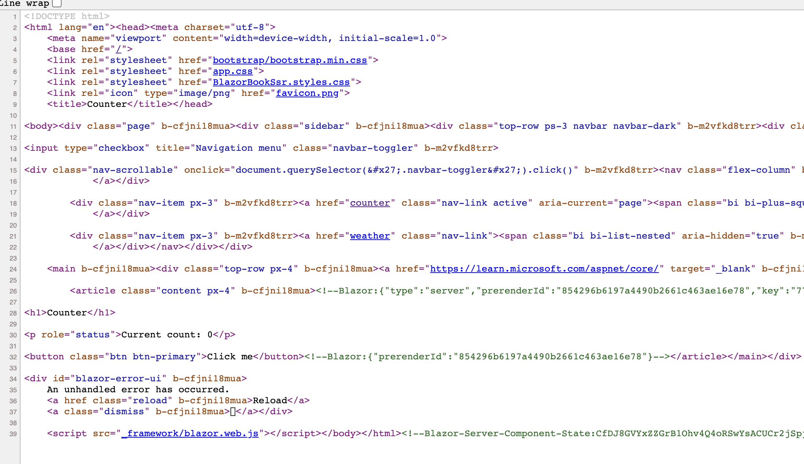
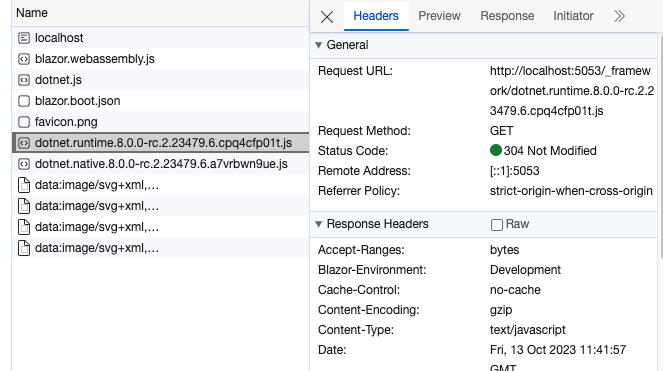

## 📗 eBook COMPLETO: Blazor com .NET 8
- [👉 Clique aqui para baixar seu eBook 👈](https://go.balta.io/ebook-blazor?utm_source=Website&utm_campaign=website-to-lp&utm_content=blog-post&utm_medium=article)

## Entendendo as segmentações do Blazor

[No artigo anterior](https://balta.io/blog/o-futuro-do-aspnet-e-blazor) falamos sobre SPA, SSR, WASM e agora vamos entender com mais detalhes como o Blazor trata estes itens, vamos entender na prática a diferença entre uma aplicação WASM e um Server ou SSR.

## Blazor SSR e Server

Quando servimos uma aplicação Blazor do lado do servidor nós temos um comportamento parecido (Explicado na parte de Streaming) que é a renderização da página por completo.


Este é um comportamento que acontece em basicamente todas as aplicações em um primeiro momento, e no Blazor SSR ou Server não é diferente.

Temos a requisição e carregamento da página, e como esperado, temos todo o conteúdo da página inserido no HTML, já que ele veio do servidor.


O trecho que mais nos interessa (Além do cabeçalho) é o corpo da página, que no caso possui o seguinte HTML.

```html
<h1>Hello, world!</h1>

Welcome to your new app.
</article></main></div>
```

Este conjunto (Cabeçalho e corpo) é que o facilita com que os mecanismos de busca (SEO - Search Engine Optimization) façam a indexação da nossa aplicação.

O problema nestes cenários é que para uma simples atualização, precisamos renderizar a página toda novamente (Calma que o Blazor não faz isto por padrão).

Vamos analisar o comportamento quando trocamos de página, por exemplo para o contador que vem no template padrão do Blazor.


Como podemos visualizar acima, somente um item chamado `counter` foi adicionado, o que significa que ele não baixou todo HTML e CSS novamente, apenas o “miolo” da página.

Este comportamento pode mudar de acordo com o modo de renderização (Render Mode) que escolhemos para página ou componente. Vamos tratar deles mais tarde.

De qualquer forma, surpreendentemente ainda assim temos um conteúdo do HTML atualizado, como mostrado na imagem abaixo.



Novamente nosso foco é o cabeçalho e o corpo, e para nossa surpresa, o corpo da página no HTML também foi atualizado.

```html
<h1>Counter</h1>

<p role="status">Current count: 0</p>

<button class="btn btn-primary">Click me</button><!--Blazor:{"prerenderId":"854296b6197a4490b2661c463ae16e78"}--></article></main></div>
```

Isto se deve a um recurso do Blazor chamado Enhanced Navigation (Que também vamos explorar melhor adiante) e que nos permite transitar entre páginas de forma rápida mas com conteúdo do HTML sendo modificado.

Mas o que será que ocorre quando clicamos no botão “Click me” da página `Counter`, que tem que incrementar um número no texto acima dele?


Neste momento não vemos nenhum carregamento da página, nem um loading, nem nada, a página sequer pisca.

Isto ocorre por que uma vez a página carregada (No modelo Blazor Server), os componentes (Pedaços da página) são interativos.

Desta forma, quando clicamos no botão, ele simplesmente busca apenas os dados no servidor. Na verdade ele incrementa mais um no contador, e retorna o valor atualizado, mas tudo é feito do lado do servidor.

Este processo é feito por que as aplicações Blazor Server mantém uma conexão (Socket via SignalR) aberta com o servidor, para trafegar dados.

Então, se notarmos, embora a tela tenha se atualizado, o HTML por baixo dela não mudou.


Novamente focamos na sessão que nos interessa, e podemos notar que o `Current count:` ainda continua com o valor `0`.

```html
<h1>Counter</h1>

<p role="status">Current count: 0</p>

<button class="btn btn-primary">Click me</button></article></main></div>
        <!--Blazor:{"prerenderId":"896ed21729c044739ddfbefcddc7d428"}-->
```

Este é um comportamento normal em cenários SPA, onde o HTML é gerado dinamicamente, e todo conteúdo gerado desta forma não aparece no “Visualizar código fonte da página”, ou seja, afeta o SEO.

De qualquer forma, temos a opção de renderizar toda página novamente caso necessário, vai realmente do que você precisa naquele momento.

## Blazor WASM

Na outra ponta temos o Blazor WASM ou Blazor WebAssembly, que como já comentamos é a possibilidade de rodar o .NET e C# direto no navegador.

Não há como discutir a performance do WASM em relação ao Server, visto que todo conteúdo é processado localmente, na máquina do usuário.

O que precisamos discutir aqui são suas desvantagens em relação ao outro modelo, que começam com o tamanho do seu aplicativo.



Ao iniciar uma aplicação Blazor WASM, podemos notar a adição de um arquivo chamado `dotnet.runtime`, que conforme comentamos antes é o que faz o .NET rodar dentro do navegador.

Além disso, podemos notar que o o conteúdo da página é igual ao que vimos anteriormente, no Blazor Server.


Porém, a maior diferença está por baixo dos panos, no HTML, onde temos o comportamento padrão de qualquer SPA.

Neste modelo, temos um HTML básico, feito para ser renderizado o mais rápido possível, e posteriormente vamos trocando o “miolo” dele sem atualizar a página.


Como podemos notar, o corpo da nossa página fica basicamente em branco, o que afeta o SEO, tendo como resultado apenas este HTML.

```html
<div id="app">
    <svg class="loading-progress">
        <circle r="40%" cx="50%" cy="50%" />
        <circle r="40%" cx="50%" cy="50%" />
    </svg>
    <div class="loading-progress-text"></div>
</div>
```

Não importa qual página acessarmos, nem quantos componentes renderizarmos na tela, no modelo WASM o HTML será sempre este.

## Blazor Auto

Embora você possa escolher entre SSR e Server ou WASM, existe um novo modo no Blazor, chamado de automático.

Neste modo, o Blazor se encarrega de usar WASM ou Server para seus componentes ou páginas. Isto mesmo, ele pode ser definido por componente ou página utilizando o atributo `RenderMode`.

### A mágica do RenderMode Auto

Quando definimos uma página ou componente com renderização automática, o Blazor sabe que componentes WebAssembly são mais rápidos por rodarem localmente.

Porém ele também sabe que o WASM demora mais para ser renderizado na primeira vez, devido a dependência do .NET.

Então ele faz o seguinte, renderiza este componente pela primeira vez no lado do servidor e deixa uma tarefa em segundo plano sendo executada.

Esta tarefa baixa o Runtime do .NET, que é a dependência mais pesada do Blazor WASM enquanto o usuário interage normalmente com o componente que foi servido.

A próxima vez que um componente ou página for renderizado, ele verifica se o Runtime já foi baixado, e então utiliza toda performance do WASM.

É uma saída muito inteligente, para manter performance e usabilidade nas aplicações de forma simples para nós (Só trocamos uma linha de código).
